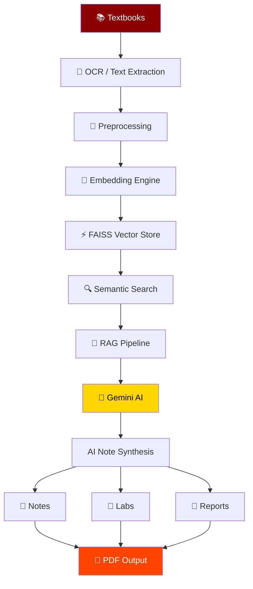
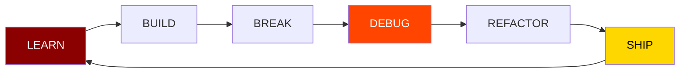

<div align="center">

<!-- Animated capsule header -->


<!-- Typing animation -->
<a href="#">
  
</a>

<br/>


</div>

---

## 🐉 THE LEGEND BEGINS

```java
public class Developer {

    public static void main(String[] args) {

        boolean bugDetected = true;

        while (bugDetected) {

            System.out.println("Searching for the bug...");

            debug();
            test();
            refactor();

            bugDetected = false;
        }

        System.out.println("🔥 SYSTEM RESTORED");
    }

    static void debug()    { System.out.println("🐉 Dragon found..."); }
    static void test()     { System.out.println("⚔️ Testing the attack..."); }
    static void refactor() { System.out.println("🧠 Critical refactoring!"); }
}
```

<div align="center">

</div>

> **Sometimes you write the code.**
> **Sometimes the code summons the dragon.**
> **Either way — you debug until you win.** ⚔️

---

## 🧙‍♂️ PLAYER PROFILE

<table align="center">
<tr>
<td width="55%" valign="top">

```text
╔══════════════════════════════════════════╗
║               PLAYER CARD                 ║
╠══════════════════════════════════════════╣
║  Name        : Swayam                     ║
║  Class       : AI Engineer / Full Stack   ║
║  Speciality  : AI • ML • Research • Web   ║
║  Weapon      : Python + C++ + Java        ║
║  Secondary   : JavaScript + SQL           ║
║  Next Level  : Senior Dragon Slayer       ║
╚══════════════════════════════════════════╝
```

**🎯 Current Main Quest**
Build intelligent systems that solve real-world problems.

**⚔️ Active Side Quests**
- 🤖 Building AI-powered applications
- 🧠 Researching Machine Learning & Generative AI
- 🌐 Developing full-stack applications
- 🎮 Experimenting with game development
- ☁️ Learning cloud, DevOps and system design
- 🛡️ Exploring cybersecurity

</td>
<td width="45%" valign="center" align="center">


</td>
</tr>
</table>

---

## 🐲 THE DRAGON

<div align="center">

</div>

```text
              🔥 🔥 🔥
          🔥    🐉    🔥
             /████\
        ____/██████\____
       /                \
      /   CODE DRAGON     \
      \                   /
       \_________________/

          HP: ████████████████████ 100%

          ⚔️ ATTACK OPTIONS
          [ DEBUG ] [ REFACTOR ] [ TEST ] [ DEPLOY ]

          Dragon Status: 🟢 ACTIVE
```

The dragon isn't a fake statistic — it's the **guardian of every bug hiding in production code.**

---

## 🛠️ ARSENAL

<div align="center">

**💻 Languages**
<br/>


**🤖 AI / Machine Learning**
<br/>

<br/>
`NumPy` `Pandas` `Scikit-learn` `Generative AI` `LLMs` `RAG` `LangChain` `LlamaIndex`

**🌐 Web Development**
<br/>


**🗄️ Databases**
<br/>


**☁️ Cloud & DevOps**
<br/>


</div>

---

## 🏰 BOSS FIGHT HISTORY

<div align="center">

| 👹 Boss | ⚔️ Weapon | 🏆 Result |
|---|---|---|
| 🐍 Merge Conflict Hydra | `git rebase` | ✅ Defeated |
| 🔁 Infinite Loop Wyrm | `break;` | ✅ One-shot |
| 👻 Works-on-My-Machine Phantom | Docker | ✅ Banished |
| 🐙 Dependency Kraken | Package management | ⚠️ Survived |
| 🔥 3AM Deployment Demon | Coffee + debugging | ⚠️ Barely survived |
| 🧠 NullPointerException Beast | Defensive programming | ✅ Defeated |

</div>

---

## 🧪 RESEARCH LAB — AI Textbook & Lab Synthesizer

An AI-powered system that transforms technical textbooks and learning resources into structured, intelligent study material.

<div align="center">



</div>

**Features**
📖 Multi-book semantic retrieval · 🔎 Semantic chapter search · 🧠 Vector embeddings · ⚡ FAISS similarity search · 🤖 Retrieval-Augmented Generation · 📝 AI note synthesis · 🧪 Lab content generation · 📑 Academic report generation · 📄 Professional PDF output · 🔀 Intelligent query routing · 🎯 Automatic format detection

---

## 🚀 PROJECT REALM

<table align="center" width="100%">
<tr>
<td width="33%" valign="top" align="center">

### 🤖 Artificial Intelligence
```text
LLMs
 ├── RAG
 ├── Semantic Search
 ├── AI Agents
 ├── Knowledge Retrieval
 ├── Document Intelligence
 └── Generative AI
```

</td>
<td width="33%" valign="top" align="center">

### 🎮 Game Development
```text
C++
 └── SFML
      ├── Game Mechanics
      ├── Collision Detection
      ├── Player Systems
      └── Enemy Systems
```

</td>
<td width="33%" valign="top" align="center">

### 📊 Data & Analytics
```text
Dataset
   ↓ Cleaning
   ↓ Exploration
   ↓ Visualization
   ↓ Machine Learning
   ↓ Insights
```

</td>
</tr>
</table>

---

## 🧠 DEVELOPER MINDSET

<div align="center">



</div>

---

## 🏆 ACHIEVEMENTS

<div align="center">

| Badge | Achievement |
|---|---|
| 🥋 | National-Level Taekwondo |
| 💻 | Computer Science Engineering |
| 🤖 | AI / ML Projects |
| 🔬 | AI Research |
| 🎮 | Game Development |
| 📊 | Data Analytics |
| ☁️ | Cloud & DevOps |
| 🧠 | Generative AI |

</div>

---

## ⚡ SYSTEM TERMINAL

```text
> booting developer.exe...
[████████████████████] 100%

✓ Loading Python        ✓ Loading Docker
✓ Loading C++            ✓ Loading Research Mode
✓ Loading Java           ✓ Dragon detected

> Dragon.exe started

🐉: "Who dares enter production?"
🧑‍💻: "Someone who forgot to commit."
🐉: "..."
🐉: "You have chosen death."

⚔️ BATTLE STARTED
```

---

## 🐉 FINAL BOSS

```python
while True:
    learn()
    build()
    fail()
    debug()
    improve()

    if problem_solved:
        ship()
    else:
        summon_dragon()
```

<div align="center">

### ⚔️ BUILD. BREAK. DEBUG. REPEAT. ⚔️
🐉 **The dragon is waiting.**

</div>

---

## 🤝 OPEN TO QUESTS

<div align="center">

**Software Engineering • AI/ML • Generative AI • Full-Stack Development • Cloud/DevOps • AI Research**

🏰 **THE DRAWBRIDGE IS DOWN.**
🐉 Dragon: **Friendly** &nbsp; ⚔️ Bugs: **Not Welcome** &nbsp; ☕ Coffee: **Required** &nbsp; 🚀 Deployment: **Pending**

<br/>


<br/><br/>

<i>"Every great system started as an idea."</i>

<br/>

🐉⚔️ **WELCOME TO THE REALM.** ⚔️🐉


</div>
